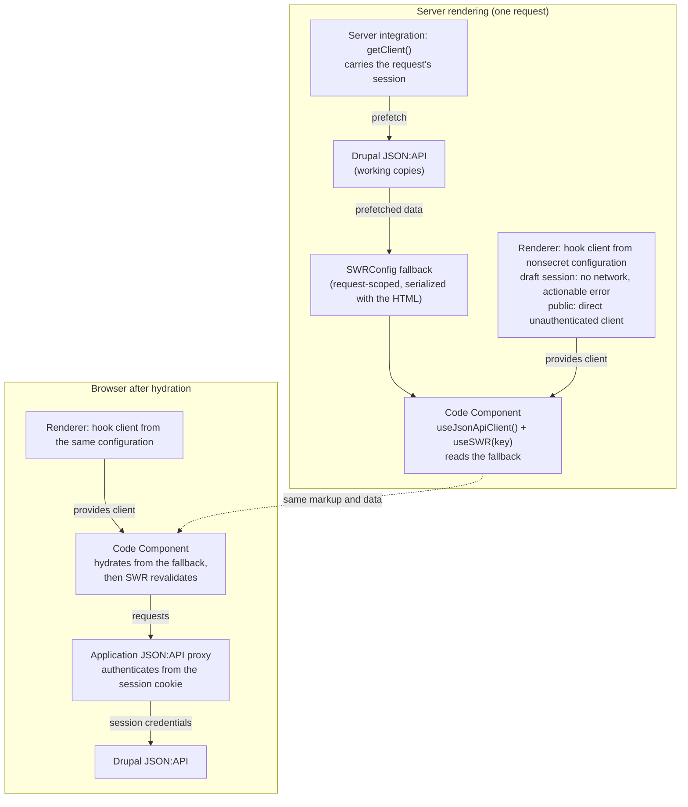

# 21. Code component runtime compatibility across frontend modes

Date: 2026-09-25

## Status

Accepted.

## Context

Code Component rendering depends on the frontend mode:

- In Drupal-rendered frontends, Code Components are authored as React
  components. Drupal renders the surrounding page and embeds them as
  browser-rendered islands. The default runtime uses Preact, with React imports
  mapped to Preact's compatibility layer.
- In headless frontends, an application uses the Canvas Headless SDK to obtain
  page content and integrate Code Components into its rendering environment.
  Headless applications can use any frontend framework; components are not
  restricted to React.

The goal of this ADR is to enable reuse of the same React Code Components in
Drupal-rendered frontends and React-based headless frontends. Page and site data
remain available to non-React applications, but how those applications access
and distribute the data is outside this ADR's scope.

Every public `drupal-canvas` runtime API needs an explicit compatibility
decision for the two React Code Component environments: support both, deprecate
the API with replacement guidance, or reject unsupported usage with actionable
errors. This includes data access, Drupal integration, components, and rendering
utilities.

## Decision

### Scope

This ADR covers all public `drupal-canvas` runtime exports, including root and
subpath exports, aliases, and runtime re-exports, together with their public
type contracts.

#### Page and site data

| API           | Public import paths and export names                                |
| ------------- | ------------------------------------------------------------------- |
| `getPageData` | Named export from `drupal-canvas` and `drupal-canvas/drupal-utils`. |
| `getSiteData` | Named export from `drupal-canvas` and `drupal-canvas/drupal-utils`. |

#### Data and Drupal integration

| API               | Public import paths and export names                                                                                                                                        |
| ----------------- | --------------------------------------------------------------------------------------------------------------------------------------------------------------------------- |
| `JsonApiClient`   | Named export from `drupal-canvas` and `drupal-canvas/jsonapi-client`, including its constructor, options, inherited methods, response serialization, and cache behavior.    |
| `sortLinksetMenu` | Named export from `drupal-canvas`; exported as `sortMenu` from `drupal-canvas/drupal-utils`.                                                                                |
| `sortMenu`        | Named export from `drupal-canvas` and `drupal-canvas/jsonapi-utils`. This is distinct from the linkset helper exported under the same name by `drupal-canvas/drupal-utils`. |
| `getNodePath`     | Named export from `drupal-canvas` and `drupal-canvas/jsonapi-utils`.                                                                                                        |

#### Components

| API               | Public import paths and export names                                                          |
| ----------------- | --------------------------------------------------------------------------------------------- |
| `FormattedText`   | Named export from `drupal-canvas`; default export from `drupal-canvas/FormattedText`.         |
| `Image`           | Named export from `drupal-canvas`; default export from `drupal-canvas/next-image-standalone`. |
| `Region`          | Named export from `drupal-canvas`.                                                            |
| `RegionsProvider` | Named export from `drupal-canvas`.                                                            |

#### General and rendering utilities

| API                       | Public import paths and export names                                                           |
| ------------------------- | ---------------------------------------------------------------------------------------------- |
| `cn`                      | Named export from `drupal-canvas` and `drupal-canvas/utils`.                                   |
| `canvasTreeToSpec`        | Named export from `drupal-canvas/json-render-utils`.                                           |
| `specToCanvasTree`        | Named export from `drupal-canvas/json-render-utils`.                                           |
| `renderSpec`              | Named export from `drupal-canvas/json-render-utils`.                                           |
| `renderCanvasTree`        | Named export from `drupal-canvas/json-render-utils`.                                           |
| `defineComponentRegistry` | Named export from `drupal-canvas/json-render-utils`.                                           |
| `defineComponentCatalog`  | Named export from `drupal-canvas/json-render-utils`, including the returned catalog's methods. |

#### Upstream runtime re-exports

The following APIs are named exports from `drupal-canvas/jsonapi-client`,
re-exported through `@drupal-api-client/json-api-client`. They are not exported
from the package root.

- `DefaultSerializer`
- `createCache`

Together, these groups contain 19 distinct runtime APIs. Alternate import paths
and export names are included in the scope, not counted as additional APIs.

#### Public types and associated contracts

Named type exports from `drupal-canvas/json-render-utils`:

- `CanvasComponentTreeNode`
- `CanvasComponentTree`
- `AuthoredSpecElement`
- `AuthoredSpecElementMap`
- `AuthoredSpecSlots`
- `ComponentRegistry`

Named upstream type re-exports from `drupal-canvas/jsonapi-client`:

- `CreateOptions`
- `DeleteOptions`
- `EndpointUrlSegments`
- `EntityTypeWithBundle`
- `GetOptions`
- `JsonApiClientOptions`
- `JsonApiIndex`
- `RawApiResponseWithData`
- `RequestBaseOptions`
- `UpdateOptions`

The scope also includes the parameter, prop, return-value, and returned-object
contracts of each runtime API, even when their types are not separately exported
by name. This includes page and site data, menu inputs and outputs, component
props, and catalog validation results.

Types follow the decisions for their APIs: retain authoring types with the
Workbench and CLI utilities, preserve upstream JSON:API contracts, and keep the
existing types for unchanged and deprecated APIs. Replacement hooks and
providers use the public types defined below.

### React context entry point

The React context APIs use `drupal-canvas/react`: `CanvasContextProvider`,
`usePageContext`, `useSiteContext`, `useHasCanvasContext`,
`JsonApiClientProvider`, `useJsonApiClient`, and `useHasJsonApiClient`.
Their provider prop types, `CanvasContextProviderProps` and
`JsonApiClientProviderProps`, use the same entry point. These APIs are not
aliased at the package root. Framework-neutral context data and client types
remain available from `drupal-canvas`.

Existing components and utilities keep their public paths: `FormattedText`,
`Image`, `Region`, and `RegionsProvider` remain at the root, existing subpaths
remain supported, and authoring helpers remain at `drupal-canvas/json-render-utils`.
This is not a migration of existing component imports.

### Replace page and site getters with context hooks

Replace `getPageData()` with `usePageContext()` and `getSiteData()` with
`useSiteContext()` from `drupal-canvas/react` as the shared APIs for React Code
Components. The replacement hooks synchronously read React context; they do not
fetch data or read global Drupal settings directly.

When context is available, the hooks return objects with the same shapes as
`getPageData()` and `getSiteData()`:

- Page context: page title, breadcrumbs, and primary entity metadata, including
  language and translation information. The primary entity can be `null`.
- Site context: Drupal's backend base URL, branding, and theme logo and favicon
  information.

Deprecate `getPageData()` and `getSiteData()` in favor of the hooks, but keep
them working in Drupal-rendered Code Components and Workbench for backward
compatibility. Outside those environments, the getters throw actionable
migration errors as described below. Components that need to work in both
frontend modes must migrate to the hooks.

A shared Code Component uses the same hooks in either frontend:

```tsx
import { usePageContext, useSiteContext } from 'drupal-canvas/react';

export default function PageHeader() {
  const page = usePageContext();
  const site = useSiteContext();

  if (!page || !site) return null;

  return (
    <header>
      <a href={site.branding.homeUrl}>{site.branding.siteName}</a>
      <h1>{page.pageTitle}</h1>
    </header>
  );
}
```

When no provider exists or its corresponding page or site value is `null`,
return `null` and emit a deduplicated, actionable developer warning. Do not
replace missing context with a default object. A supplied object with
`mainEntity: null`, empty theme assets, or other valid empty values is not
missing context and does not trigger a warning.

#### React-based headless rendering

Return page and site context with the component tree in the same `fetchPage()`
response. Application authors pass that context to `CanvasComponentTree`, which
establishes the provider internally. No separate provider or data request is
required in application code.

The proposed usage keeps the existing `tree={page.content}` contract:

```tsx
const page = await canvas.fetchPage('/about');

return (
  <CanvasComponentTree
    tree={page.content}
    context={page.context}
    components={componentRegistry}
  />
);
```

Here, the proposed `page.context` contains both `page` and `site` context. Any
React descendant of the renderer can consume it through the shared hooks.
Context belongs to the rendered tree and request, not a process-global current
page. Server rendering and initial hydration use the same snapshot; navigation
and preview updates replace context together with the corresponding content.

Drupal generates the data for the resolved page, preserving its language,
access, cacheability, and draft-preview semantics. The headless application does
not reconstruct Drupal metadata independently.

#### Public context API

Export `PageContext`, `SiteContext`, and `CanvasContext` from `drupal-canvas`.
`PageContext` and `SiteContext` preserve the existing getter data shapes:

```ts
interface CanvasContext {
  page: PageContext | null;
  site: SiteContext | null;
}
```

`fetchPage()` returns `CanvasContext` as `page.context`. The renderer accepts
`context?: CanvasContext` so existing renderer usage remains valid. When
supplied, the renderer wraps its tree in a provider using that context. When
omitted, it inherits the surrounding `CanvasContextProvider` without adding
another provider. If neither supplies context, or the corresponding value is
`null`, the corresponding hook returns `null` and warns as described above. The
return types are `usePageContext(): PageContext | null` and
`useSiteContext(): SiteContext | null`.

An explicit `context` prop takes precedence over an outer provider, including
`null` page or site values; it does not merge with inherited context.

Export `CanvasContextProvider` from `drupal-canvas/react` with a `context` prop and
React children. The rendering integrations use this provider internally.
Application authors can also use it to make context available to components
outside the Canvas tree, such as a site header:

```tsx
<CanvasContextProvider context={page.context}>
  <SiteHeader />
  <CanvasComponentTree tree={page.content} components={componentRegistry} />
</CanvasContextProvider>
```

Both forms are supported: pass `page.context` to the renderer for standalone
usage, or wrap the renderer and other components in an explicit provider.

#### Drupal-rendered Code Components

Wrap every Code Component island in the same provider through the shared island
renderer. The provider adds no DOM wrapper, and authors do not change their
component exports.

Each island needs its own provider, including islands nested through slots:
separate rendering roots do not inherit React context from one another. The
provider and hooks must share the same context instance through Drupal's
Preact-compatible runtime.

Extend import-based data-dependency detection to recognize the new hooks while
retaining support for the getters. This preserves selective settings attachment
rather than making every provider request all data unconditionally.

When a preview replaces or rerenders an island, supply fresh context. Changes to
`drupalSettings` alone are not reactive: settings-only updates must also refresh
the provider. Component-only previews must supply preview context or report it
as unavailable, not reuse an unrelated page's context.

Keep settings extraction separate from editor instrumentation. Preserve the
getters' `_canvas_useswr_data_fetch` messages for the code editor's Component
data panel; these messages must not fetch data or refresh previews. Providers
must not call both getters on every island mount merely to obtain data. Preserve
data inspection through deduplicated reporting of hook usage, separate from the
shared context mechanism.

#### Workbench previews

Workbench must support the same context hooks without requiring changes to Code
Components. Wrap both the interactive preview's `renderSpec()` output and the
generated preview entry's output in `CanvasContextProvider`, including page
templates and their page content.

Change only the component-facing API, not Workbench's data-loading behavior. The
Vite integration must load `/canvas/api/v0/site-data` once and pass the data
directly to the provider, preserving existing values and fallbacks, including
Drupal theme assets. Also populate `drupalSettings` for legacy consumers,
including `getPageData()`, `getSiteData()`, and the legacy `JsonApiClient`. This
is a compatibility mechanism, not the data source for the new context API.

Do not load page-specific Drupal context in Workbench. Use the page defaults:
`pageTitle: ''`, `breadcrumbs: []`, and `mainEntity: null`. These are the
Workbench provider's page-context values, not a missing-provider condition. Do
not introduce page selection, additional page requests, or authored fixtures as
part of this change.

The interactive iframe stays mounted across preview targets. Ensure the provider
reflects the current data during preview updates and hot updates. Verify that
hooks and legacy getters expose equivalent data in both preview rendering paths.

#### Navigation URLs and headless theme assets

Preserve the existing Drupal-generated navigation URLs, including breadcrumbs,
translation links, and the branding home URL. Do not add headless-specific URL
rewriting; applications handle any routing adjustments.

In headless context, return logo and favicon values from Drupal's configured
default theme, preserving the `themeAssets` shape. Select the theme explicitly
from `system.theme:default`, without request theme negotiation or selection of
an active/admin theme. Frontends choose whether to use these assets; returning
them allows branding to be managed in Drupal without another settings request.

Use Drupal's theme settings and file URL resolution, including global settings,
custom asset paths, theme/core defaults and the configured favicon MIME type.
Response cacheability must account for the default-theme selection, installed
themes, and global and theme-specific settings, including the first save of
previously absent settings. Asset file paths and MIME settings are configuration;
replacing file contents without changing those values does not change context.

Drupal-rendered Code Components and Workbench retain their existing active-theme
behavior. Shared components must still handle empty asset URLs when assets are
unset or disabled. Preserve the configured favicon MIME type even if its URL is
empty. Empty theme assets do not make site context unavailable or trigger a
missing-context warning.

### Consolidate JSON:API clients behind a context hook

Combine the `drupal-canvas` client and the headless SDK's draft client into one
implementation in `drupal-canvas`, extending
`@drupal-api-client/json-api-client`. The SDK remains responsible for
environment configuration and preview sessions; the shared client stays usable
in browsers.

Although this ADR targets React Code Component compatibility, the JSON:API
client and its supporting utilities must be framework-agnostic. Configuration,
draft handling, proxy logic, and URL mapping must work without React in any
frontend framework. React hooks and providers are a convenience layer over this
shared implementation, not a requirement for using it.

React Code Components use `useJsonApiClient()` from `drupal-canvas/react`. The hook
reads a client from context. It does not fetch data or create a client on each
render. Components can use the client with SWR or another fetching library.

The Drupal island renderer, headless React renderer, and both Workbench preview
paths add the provider automatically. Export `JsonApiClientProvider` with a
`client` prop for components outside the Canvas tree. Reuse the client while its
configuration and session stay unchanged. Without a provider, the hook returns
`null` and warns how to fix the missing integration, without repeating warnings.

Do not include the client in `page.context`. Server rendering and browser
hydration each create their own client from the same nonsecret configuration,
so the hook returns a client on both sides and prefetched SWR fallback data
renders without a hydration mismatch. In a draft session the server-rendered
client reaches no draft data: it refuses network requests with an actionable
error, and draft data enters the initial HTML only through the server
integration's prefetch and SWR fallback data. Keep preview tokens out of React
context and serialized page data.

Keep the legacy `new JsonApiClient()` API working in Drupal-rendered Code
Components and Workbench. Outside those environments, it throws an actionable
migration error, even when an explicit backend URL is supplied. Components
shared across frontend modes use `useJsonApiClient()`; headless server code uses
the SDK's `getClient()`.

This restriction applies to the legacy public constructor, not the shared client
implementation. SDK factories and rendering integrations use a separate internal
construction path to create the shared client without invoking the legacy
environment guard.

#### Legacy API compatibility and errors

`getPageData()`, `getSiteData()`, and the legacy `new JsonApiClient()` API
remain backward-compatible in Drupal-rendered frontends and both Workbench
preview paths. They throw immediately when invoked in headless or any other
environment. Importing these APIs alone does not throw.

Each error identifies the unsupported API and gives concrete migration guidance:

- `getPageData()`: use `usePageContext()` in React components, or read
  `page.context.page` from the Headless SDK's page response outside components.
- `getSiteData()`: use `useSiteContext()` in React components, or read
  `page.context.site` from that response outside components.
- `new JsonApiClient()`: use `useJsonApiClient()` in React components, or the
  SDK's `getClient()` in headless server code.

Use an explicit runtime marker established by Drupal and Workbench integrations
to identify the supported legacy environments. Do not treat the presence of
`window`, a backend URL, or a user-created `drupalSettings` object as proof that
the caller is running in Drupal or Workbench. This marker is a compatibility
check, not a security boundary.

These errors require migration rather than returning defaults. In contrast,
`usePageContext()`, `useSiteContext()`, and `useJsonApiClient()` return `null`
and emit a deduplicated warning when their required context is missing.

Include a short AI-agent migration prompt in these errors:

> Replace `getPageData()`, `getSiteData()`, and `new JsonApiClient()` with
> `usePageContext()`, `useSiteContext()`, and `useJsonApiClient()` in function
> components or custom hooks. Call hooks unconditionally at the top level before
> any possible return; handle missing context or clients. Outside components and
> custom hooks, use SDK page context data or `getClient()` in headless server
> code; pass data or a client to browser helpers. Preserve output, types, hook
> order, and access controls. Never expose credentials.

#### Migrate safe getter calls with a pull codemod

Make getter migration a codemod—an automatic source-code rewrite—run as part of
pull, with no separate opt-in or opt-out. Enable conversion only when the
connected Drupal site advertises context-hook support through
`/canvas/api/v0/site-data` (`capabilities.contextHooks`) and the installed
`drupal-canvas/react` entry exports both hooks as runtime values. The site
capability covers the React import-map entry and provider integration. Verify
the installed entry statically under import export conditions; a root-only
package does not satisfy this check. No additional capability flag is needed.
If either check fails or cannot be verified, leave getter calls
unchanged and report the limitation with migration guidance. Extend Drupal's
import-based dependency detection together with the hooks so migrated components
still receive their data.

Convert imported `getPageData()` and `getSiteData()` calls to `usePageContext()`
and `useSiteContext()` only when every getter usage in that component file is
safe: the imported binding is resolved, the call has no arguments, it occupies
an unconditional valid hook position in a function component with no earlier
possible return, and the replacement introduces no identifier conflicts.
Preserve hook ordering and behavior, and avoid type changes other than the
nullable hook results described below. If these safety checks are uncertain,
leave the file unchanged. Other safe component files may still migrate. Client
construction and pulled helper modules receive diagnostics only, not automatic
conversion.

The codemod assumes rendering integrations supply page and site context. Replace
otherwise safe calls directly; do not skip them solely because the hooks return
nullable types. Generate no null guards, fallback values, or non-null
assertions. Strict TypeScript checks may still require follow-up for nullable
results; report this limitation with the successful conversions.

Import replacement hooks from `drupal-canvas/react`. Keep import changes minimal
and account for aliases. Remove legacy imports only when unused; do not rewrite
unrelated component or utility imports.

Show planned conversions before pull confirmation and honor `--yes`. Never
modify files protected by `--skip-overwrite`. Report successful conversions with
file names and API replacements, as well as per-file warnings for remaining
cases. For those cases, print one consolidated file list and AI-agent migration
prompt in the terminal, using the guidance above; do not insert prompts into
source files.

#### Public client-provider API

Export `useJsonApiClient`, `JsonApiClientProvider`, and
`JsonApiClientProviderProps` from `drupal-canvas/react`. Use the shared
`JsonApiClient` type rather than introducing a separate React-specific client
interface:

```tsx
interface JsonApiClientProviderProps {
  client: JsonApiClient;
  children: ReactNode;
}

function useJsonApiClient(): JsonApiClient | null;
```

The provider receives an already configured client. It does not construct one or
manage authentication. The hook returns the nearest provider's client, or `null`
with the deduplicated warning described above when no provider exists.

Rendering integrations own client creation and reuse. When configuration or
preview state changes, they supply the appropriate client. Client instances are
runtime objects, never serialized props across a server/browser boundary.

Application authors can provide a client explicitly for components outside the
Canvas tree:

```tsx
<JsonApiClientProvider client={client}>
  <SiteHeader />
  {children}
</JsonApiClientProvider>
```

Headless rendering integrations accept explicit, serializable JSON:API runtime
configuration: the resolved upstream JSON:API URL, local proxy URL, supporting
endpoint mappings, and nonsecret preview state, including the resource version.
The SDK's server integration prepares this configuration; framework adapters
pass it to the React rendering integration. Do not infer it from the component
tree or include it in the page/site data contract.

The rendering integration creates the browser client from this configuration.
Server rendering creates its client from the same configuration: a direct,
unauthenticated client for public content, and for a live draft session the
same draft-aware client the browser gets, except that it performs no network
requests — a draft request made while rendering fails with an error that names
the prefetch path. The request's session is used only by the SDK's server
integration (`getClient()`), never by the renderer, and credentials are never
serialized. The generic React renderer must not import server session code. If
automatic client configuration is unavailable, retain an explicitly supplied
outer `JsonApiClientProvider`; otherwise leave the client unavailable and use
the hook's missing-provider behavior.

Replacing the provided client updates consumers but does not itself clear SWR
caches. Browser data refresh and cache clearing require separate integration.

#### Configuration and responsibilities

- Drupal supplies its backend URL and JSON:API settings. Keep existing
  authentication behavior: credentials and Drupal permissions determine which
  content is accessible. In Drupal previews, the provider configures the shared
  client to request `rel:working-copy`, using the editor's Drupal session and an
  explicit preview flag. Normal page rendering and legacy `new JsonApiClient()`
  calls keep their existing revision behavior. Unsaved Canvas editor state is
  outside this change's scope.
- Workbench uses its existing live Drupal configuration. Keep its data loading,
  previews, and settings for legacy consumers unchanged.
- The headless SDK reads the backend URL from explicit configuration or
  `CANVAS_SITE_URL`. It discovers the JSON:API prefix through
  `/canvas/api/v0/site-data`. If discovery fails, it uses the configured prefix
  or `CANVAS_JSONAPI_PREFIX`. Combine the backend URL and resolved prefix into
  the full upstream JSON:API base URL. An explicit full URL override takes
  precedence over discovery.
- The SDK supplies authentication to server requests and nonsecret preview
  configuration, including the resource version, to the browser client. Its
  public and draft client factories create the shared client instead of
  maintaining a separate subclass.

#### Headless browser requests use a JSON:API proxy

Add a same-origin JSON:API proxy to the headless application. The application
configures its local URL; the SDK resolves the full upstream JSON:API base URL
on the server through discovery or an explicit override. Configure supporting
endpoint paths on the same Drupal backend when needed by the client. Browser
requests cannot change the configured backend. Map local proxy paths to these
upstream endpoints and preserve the remaining path and query parameters, rather
than listing individual resource routes. The hook's browser client sends both
public and draft requests through it, using ordinary JSON:API paths and query
parameters rather than a client-operation protocol. The proxy forwards requests
and response bodies without processing JSON:API documents. Server code uses the
same client but calls Drupal directly.

```text
Code Component → shared browser client → application proxy → Drupal
Server code → shared server client → Drupal
```

Put the shared endpoint logic in the framework-independent headless SDK.
Framework adapters or custom application integrations mount the route and
provide access to the request and session. The proxy must not depend on React or
a React-specific adapter.

Reuse the SDK's preview session: a framework draft flag and an HTTP-only cookie
containing the token. Keep the `Secure`, `SameSite=None`, and `Partitioned`
cookie attributes needed for embedded previews. The browser sends these cookies
with same-origin requests, but component JavaScript cannot read the token. The
endpoint gets credentials and draft state from the session, not from values
supplied by component code.

Choose request behavior from the session:

- No preview session: make unauthenticated Drupal requests.
- Valid preview session: authenticate with the editor's credentials. The client
  supplies the resource version in the query; the proxy does not add it.
- Expired or invalid preview session: return a session error, not public
  content. Do not use a client factory's public-content fallback in this path.

Reuse the existing preview renewal and recovery lifecycle described below; do
not introduce a separate renewal mechanism for JSON:API requests.

Preview authorization follows
[ADR 14](0014-headless-draft-preview-user-bound-tokens-via-jwt-assertion-grant.md):
tokens carry the editor's permissions capped by a view-only permission ceiling,
not their full permissions. The proxy reuses that policy, and Drupal authorizes
each operation. This ADR does not introduce preview mutation support.

Restrict requests to the configured Drupal backend and supported endpoint paths.
Reject arbitrary destinations and validate paths and redirects to keep requests
within that boundary. Do not forward arbitrary browser authentication headers or
Drupal response cookies. Restrict browser access to the application's origin and
protect state-changing requests against CSRF; CORS restrictions alone are not
CSRF protection.

Keep authenticated draft responses out of shared caches with private, no-store
responses. Disable JSON:API client caches or separate them by session and
resource version. Application-owned fetching caches follow the policy below.

#### Preview renewal and application caches

Keep the renewal and recovery lifecycle from
[ADR 15](0015-headless-draft-preview-session-renewal-re-anchored-in-drupal-session.md)
unchanged. This ADR does not add automatic refresh or clearing of SWR or other
application caches after renewal. Leave these freshness and stale-data
trade-offs to applications.

#### Draft reads and response compatibility

Implement the SDK's draft-read behavior in the shared client. Apply it in the
browser for proxied requests and on the server for direct requests. Resolve
working copies before applying the configured serializer so the behavior does
not depend on a deserialized response shape. Use the shared client's default
serialization in the headless factories as well; preserving the old headless
client's default response shape is not required. The proxy does not repeat this
work:

- Resource reads use the session's resource version unless the caller selects
  one explicitly.
- Collection reads fetch each item's working copy in a separate request because
  Drupal returns default revisions in collections. If an ordinary item fetch
  fails, keep the original item. Preview-session errors must propagate rather
  than being hidden by this fallback. This does not discover every unpublished
  entity or make collection filtering and sorting use working-copy values.
- Raw responses bypass working-copy changes.

The client handles serialization and raw-response options; the proxy does not
need to interpret them. Preserve Drupal's response bodies, status codes, and
safe response headers, except when the proxy rejects a request or reports a
session error. Direct and proxied reads must agree on supported query options,
languages, errors, and response shapes.

The proxy must support all requests made by `JsonApiClient`, including
supporting endpoints outside the JSON:API prefix, such as path resolution.
Forward requests without method-specific processing, subject to the configured
backend and endpoint boundaries and Drupal's authorization policy. Supporting a
client method does not grant preview tokens permission to perform it.

The browser client's transport maps supported Drupal URLs to the local proxy,
preserving paths and query parameters. This includes absolute pagination links
and supporting endpoints, without rewriting response bodies. Do not let an
absolute Drupal URL bypass the proxy. Verify the upstream client's complete
method list and required endpoints before finalizing path configuration.

Draft collections make an additional browser-to-proxy request for each working
copy. Accept this preview-only overhead in exchange for keeping draft behavior
in one client implementation and the proxy limited to HTTP forwarding,
authentication, and access controls.

### Prefetch SWR data for server-rendered content without changing portable components

React-based headless applications can render Code Components on the server and
hydrate them in the browser. This lets the initial HTML contain meaningful
content while preserving hooks and browser interactivity. The same components
remain usable in Drupal's browser-side runtime. This approach does not require
React Server Components or a particular headless framework.

In Next.js, keep `CanvasComponentTree`'s `'use client'` boundary for registered
components. This allows hooks and interactivity without preventing Next.js from
rendering their initial HTML on the server. Other React integrations can use
their framework's server-rendering and hydration mechanisms without adopting
Next.js's boundary model.

A React Server Component (RSC) runs only on the server. It can be an `async`
function that awaits data before returning markup. Its implementation is not
sent to the browser. A Client Component can also produce HTML on the server, but
its JavaScript is sent to the browser for hydration and later interaction. Both
can put meaningful content in the initial HTML when their data is ready.

Keep Drupal Code Components compatible with browser-side Preact rather than
requiring an RSC runtime. An async Server Component is not portable to that
runtime. Browsers support `async`/`await` in fetch functions and event handlers;
the restriction is making the component function itself async. Keep shared Code
Components synchronous and handle asynchronous data separately.

Running registered components as RSCs would require moving them outside the
Next.js renderer's `'use client'` boundary. Components using hooks or
interactivity would then need their own client boundary, either in their modules
or through shared wrappers. Removing this boundary would not turn SWR fetches
into server-side requests. Keep it and use server prefetching with SWR fallback
data instead.

Server-rendering a component does not automatically fetch its SWR data. In the
normal `useSWR(key, fetcher)` flow, SWR reads available cache or fallback data
during rendering and starts fetching after the component mounts in the browser.
The server render does not wait for that fetcher. Without prefetched data, the
initial HTML therefore contains the component's loading or empty state, not the
content that arrives later.

In any server-rendered React integration, rendering a component on the server
does not make its fetcher server-only. SWR revalidation, pagination, and other
requests triggered after hydration run in the browser. Those requests need the
application proxy to use headless preview authentication. Providing a JSON:API
client through context alone does not change when SWR fetches.

Headless application authors can prefetch data on the server and supply it
through SWR's `SWRConfig` provider. A descendant Code Component's `useSWR()`
call reads the matching fallback during server rendering, so its data-filled
markup appears in the initial HTML. The component stays portable: in Drupal,
without prefetched data, it fetches in the browser as before.

Two client instances take part, and they never merge. The server integration's
client (`getClient()`) carries the request's session, talks to Drupal directly,
and produces the prefetched data. The hook's client is created by the renderer
from nonsecret configuration on both sides of hydration; on the server it has no
network access in a draft session, in the browser it reaches Drupal through the
application proxy.



For example, a portable component can use a string key:

```tsx
const client = useJsonApiClient();
const { data } = useSWR(client ? 'articles' : null, () =>
  client!.getCollection('node--article'),
);
```

The headless application fetches the same data before rendering:

```tsx
const client = await getClient();
const articles = await client.getCollection('node--article');

return (
  <SwrFallback fallback={{ articles }}>
    <CanvasComponentTree tree={page.content} context={page.context} />
  </SwrFallback>
);
```

Here, `getClient()` is the SDK's request-aware server client factory. It
configures the same shared `drupal-canvas` client implementation used by
`useJsonApiClient()`, not a separate client implementation. Server prefetch code
runs before the component tree renders, so it obtains the client directly rather
than calling a React context hook. It calls Drupal directly, using the current
preview session when applicable. The tree renderer supplies the JSON:API client
context when rendering the component.

In Next.js, `SwrFallback` is an application-owned client wrapper around
`SWRConfig`:

```tsx
'use client';

import { SWRConfig } from 'swr';

import type { ReactNode } from 'react';

export function SwrFallback({
  fallback,
  children,
}: {
  fallback: Record<string, unknown>;
  children: ReactNode;
}) {
  return <SWRConfig value={{ fallback }}>{children}</SWRConfig>;
}
```

`DefaultSerializer` adds non-enumerable `getMeta()` and `getLinks()` methods
that do not survive JSON serialization into hydration fallback data.
Applications whose components use these methods must account for that
limitation; ordinary field access is unaffected.

Fallback keys and response shapes must match the component's requests. For array
or object keys, use SWR's `unstable_serialize` to create the matching fallback
key. Share key and query helpers where useful to avoid mismatches.

Next.js sends both the rendered HTML and the serialized fallback data needed for
hydration. Only include data the current visitor may receive; never include
clients or credentials. Keep prefetched data request-scoped, and ensure the
server and browser start with the same data and preview state. SWR may
revalidate in the browser afterward, using the proxy. Application authors choose
the revalidation and cache-isolation policy. Token renewal alone does not
trigger SWR cache clearing.

The context hook does not automatically prefetch SWR requests. Without matching
fallback data, server rendering may produce only the component's loading state.
This approach uses SWR's existing provider and application-owned server
fetching; it does not introduce automatic request discovery or a Canvas
data-loader contract.

The framework-independent client leaves room for future component data loaders
or Suspense-aware server fetching. A separate headless renderer could also
support RSCs without changing the portable component model. None of these are
required by this decision.

### APIs supported unchanged

Support these APIs unchanged in both frontend modes:

- `sortLinksetMenu`
- `sortMenu`
- `getNodePath`
- `cn`
- `FormattedText`
- `Image` (`drupal-canvas/next-image-standalone`)
- `DefaultSerializer` and `createCache`, upstream re-exports from
  `drupal-canvas/jsonapi-client`.

`FormattedText` callers remain responsible for supplying trusted or sanitized
HTML.

Verify `Image` with Drupal media images, derivatives, and SVGs on a separate
headless origin, including server rendering and hydration.

### Deprecate region APIs

Deprecate `Region` and `RegionsProvider`. Page variants replace theme-global
regions with a composed page tree, as described in
[ADR 19](0019-page-variants-replace-theme-global-regions.md). Preserve their
existing behavior for compatibility, but add no new region-provider integration.
Consumers should use page variants and the composed component tree instead.

### Retain authoring utilities for Workbench and CLI

Keep the six utilities from `drupal-canvas/json-render-utils` and their types
for Workbench, CLI, and authoring workflows. They convert, render, register, and
validate authored Canvas trees and json-render specs, not the resolved content
tree returned by the Headless SDK's `fetchPage()`.

Do not deprecate them or extend them for headless rendering. Headless
applications use `CanvasComponentTree` and the SDK's component registry
machinery instead.

## Consequences

React Code Components access page and site data without branching on frontend
mode. The Drupal settings integration and headless React renderer supply the
same component-facing contract through different data-delivery paths.

Implementation spans Drupal context generation, dependency detection, the island
renderer, the headless response, and React integration.

JSON:API consolidation also requires a headless server endpoint for portable
browser reads.
