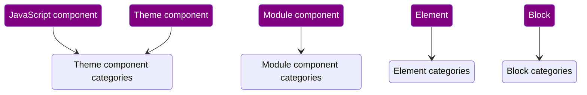

# Experience Builder Components

In the rest of this document, `Experience Builder` will be written as `XB`.

**Also see the [diagram](diagrams/data-model.md).**

## 1. Terminology

### 1.1 Existing Drupal Terminology that is crucial for XB

- `SDC`: a [Single-Directory Component](https://www.drupal.org/project/sdc)
- `Block`: a [block plugin](https://www.drupal.org/docs/drupal-apis/block-api/block-api-overview) — ⚠️ not to be confused with `Block` config entities

### 1.2 XB terminology

- `component`: a component generates markup (and might attach CSS + JS), potentially based on some input. ⚠️ This is currently limited to `SDC`s, but that _will_ change. So: read this more broadly. ⚠️
- `component prop`: each component may in its metadata define 0 or more props, each prop accepts structured data conforming to the shape defined in the `component`'s metadata
- `component slot`: each component may in its metadata define 0 or more slots, each slot accepts >=0 component instances in a particular order
- `component type`: the mechanism through which a `component` is defined (currently only `SDC` and `Block`)
  - TBD: inputs for non-`SDC` components may be modeled as `component prop`s or not
  - TBD: the `Block` component type needs to support [_contexts_](https://www.drupal.org/docs/drupal-apis/plugin-api/plugin-contexts#s-context-on-blocks), unclear how that will be surfaced in XB; initially, only block plugins that do not require contexts are supported
- `prop shape`: a normalized representation of the schema for a `component prop`, without metadata that does not affect the _shape_: a title or description does not affect what values _fit into this shape_

## 2. Product requirements

This uses the terms defined above.

(There are [more](https://docs.google.com/spreadsheets/d/1OpETAzprh6DWjpTsZG55LWgldWV_D8jNe9AM73jNaZo/edit?gid=1721130122#gid=1721130122), but these in particular affect XB's supported components.)

- MUST be possible for the Site Builder to control, audit and synchronize which `component`s are available for Content Creators → see [`XB Config Management` doc](config-management.md)
- MUST support `SDC` and `Block` today
  - MUST be evolvable to [support other component types later](https://www.drupal.org/project/experience_builder/issues/3454519)
- MUST support existing `SDC`s and `Block`s, if they meet certain criteria necessary for XB to provide a good UX
- MUST support categorization of `component`s
- MAY require API additions and perhaps even changes to `SDC`s (such as: defining restrictions for `component slot`s, schema references and more) ⚠️ [an overview of what has been identified is constantly updated](https://www.drupal.org/project/experience_builder/issues/3462705) ⚠️

⚠️ The [supported component modeling approaches](https://www.drupal.org/project/experience_builder/issues/3446083)
are not yet finalized. That is likely to affect the requirements above.

## 3. Implementation

This uses the terms defined above.

### 3.1 `SDC` `component`s

#### 3.1.1 Criteria for `SDC` `component`s

For an `SDC` to be compatible/eligible for use in XB, it:
- MUST always have schema, even for theme `SDC`s
- MUST have `title` for each prop
- MUST have `example` for each required prop
- MUST have only props for whose `prop shape`s a `static prop source` can be found (see [`XB Data model`, section 3.1.2.b](./data-model.md#3.1.2.b))
- MUST not have `status` value `obsolete`

These checks are implemented in `\Drupal\experience_builder\Plugin\ComponentPluginManager::componentMeetsRequirements()`.

These criteria are what allow significant other pieces to be built on top of it, specifically the entirety of
[`XB Data model`, section 3.1: "from Front-End Developer to an XB data model that empowers the Content Creator](./data-model.md#3.1).

_Note:_ this list of criteria is not final, it will keep evolving _at least_ until a `1.0` release of XB.

#### 3.1.2 Missing `SDC` functionality that XB already implements ahead of availability in Drupal core
- Schema references support (stored in per-extension `/schema.json` files), upstream issue: [#3352063](https://www.drupal.org/project/drupal/issues/3352063)
- … likely more to come, see the [full list](https://www.drupal.org/project/experience_builder/issues/3462705)

### 3.2 `Block` `component`s

An immediate question that will come to mind when reading this: why `Block` the _plugins_ and not `Block` the _config entities_?
It does not make sense to surface the config entities, because:
1. they're hard-coupled to a theme (region): they're a "placed block" in the Drupal UI!
2. there can be multiple instances ("placements") of the same block plugin, each with a different label, but they'd render exactly the same in XB

Therefore, it only makes sense to surface _block plugins_ as XB `component`s.

#### 3.2.1 Criteria for `Block` `component`s

For a `Block` to be compatible/eligible for use in XB it:
 - MUST have fully validatable block plugin settings config schema via the `FullyValidatable` constraint
 - MUST NOT have any required context (⚠️ handling contexts is still TBD in [#3485502](https://www.drupal.org/project/experience_builder/issues/3485502))

These checks are implemented in `experience_builder_block_alter()`.

_Note:_ this list of criteria is not final, it will keep evolving _at least_ until a `1.0` release of XB.

#### 3.2.2 Special consideration: migration from Layout Builder

The Drupal core Layout Builder module is block-centric. A migration from Layout Builder to Experience Builder (and ideally: an _upgrade_ path) MUST remain possible.

(This is product requirement [`39. Layout Builder Migration`](https://docs.google.com/spreadsheets/d/1OpETAzprh6DWjpTsZG55LWgldWV_D8jNe9AM73jNaZo/edit?gid=1721130122#gid=1721130122&range=B51).)

Layout Builder's data model is centered around 1) layout plugins, 2) blocks. Layout plugins are used to arrange instances of blocks in a particular layout. But while all documentation and UI pieces
refer to "blocks" and not "block plugins", under the hood, they actually _are_ block plugins! See `type: layout_builder.component` in `layout_builder.schema.yml`. Many details are still to be figured out for that, but that is for later.

### 3.3 Other `component type`s

Nothing yet, this will change when we [support other `component type`s later](https://www.drupal.org/project/experience_builder/issues/3454519).

### 3.4 Categorization

Each `component` can be categorized in order to group them in the UI. Some `component type`s have shared categories, as follows:

