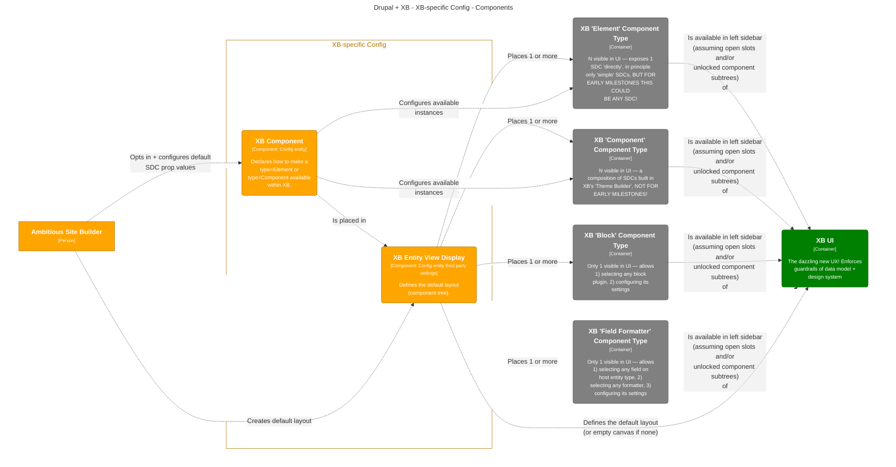

```mermaid
graph TB
  linkStyle default fill:#ffffff

  subgraph diagram ["Drupal + XB - XB-specific Config - Components"]
    style diagram fill:#ffffff,stroke:#ffffff

    1["<div style='font-weight: bold'>Ambitious Site Builder</div><div style='font-size: 70%; margin-top: 0px'>[Person]</div>"]
    style 1 fill:#ffa500,stroke:#b27300,color:#ffffff
    20("<div style='font-weight: bold'>XB 'Element' Component Type</div><div style='font-size: 70%; margin-top: 0px'>[Container]</div><div style='font-size: 80%; margin-top:10px'>N visible in UI — exposes 1<br />SDC 'directly', in principle<br />only 'simple' SDCs, BUT FOR<br />EARLY MILESTONES THIS COULD<br />BE ANY SDC!</div>")
    click 20 https://www.drupal.org/project/experience_builder/issues/3444417 "https://www.drupal.org/project/experience_builder/issues/3444417"
    style 20 fill:#808080,stroke:#595959,color:#ffffff
    24("<div style='font-weight: bold'>XB 'Component' Component Type</div><div style='font-size: 70%; margin-top: 0px'>[Container]</div><div style='font-size: 80%; margin-top:10px'>N visible in UI — a<br />composition of SDCs built in<br />XB's 'Theme Builder', NOT FOR<br />EARLY MILESTONES!</div>")
    click 24 https://www.drupal.org/project/experience_builder/issues/3444417 "https://www.drupal.org/project/experience_builder/issues/3444417"
    style 24 fill:#808080,stroke:#595959,color:#ffffff
    28("<div style='font-weight: bold'>XB 'Block' Component Type</div><div style='font-size: 70%; margin-top: 0px'>[Container]</div><div style='font-size: 80%; margin-top:10px'>Only 1 visible in UI — allows<br />1) selecting any block<br />plugin, 2) configuring its<br />settings</div>")
    click 28 https://www.drupal.org/project/experience_builder/issues/3444417 "https://www.drupal.org/project/experience_builder/issues/3444417"
    style 28 fill:#808080,stroke:#595959,color:#ffffff
    31("<div style='font-weight: bold'>XB 'Field Formatter' Component Type</div><div style='font-size: 70%; margin-top: 0px'>[Container]</div><div style='font-size: 80%; margin-top:10px'>Only 1 visible in UI — allows<br />1) selecting any field on<br />host entity type, 2)<br />selecting any formatter, 3)<br />configuring its settings</div>")
    click 31 https://www.drupal.org/project/experience_builder/issues/3444417 "https://www.drupal.org/project/experience_builder/issues/3444417"
    style 31 fill:#808080,stroke:#595959,color:#ffffff
    44("<div style='font-weight: bold'>XB UI</div><div style='font-size: 70%; margin-top: 0px'>[Container]</div><div style='font-size: 80%; margin-top:10px'>The dazzling new UX! Enforces<br />guardrails of data model +<br />design system</div>")
    click 44 https://www.drupal.org/project/experience_builder/issues/3454094 "https://www.drupal.org/project/experience_builder/issues/3454094"
    style 44 fill:#008000,stroke:#005900,color:#ffffff

    subgraph 12 ["XB-specific Config"]
      style 12 fill:#ffffff,stroke:#b27300,color:#b27300

      14("<div style='font-weight: bold'>XB Component</div><div style='font-size: 70%; margin-top: 0px'>[Component: Config entity]</div><div style='font-size: 80%; margin-top:10px'>Declares how to make a<br />type=Element or<br />type=Component available<br />within XB.</div>")
      style 14 fill:#ffa500,stroke:#b27300,color:#ffffff
      17("<div style='font-weight: bold'>XB Entity View Display</div><div style='font-size: 70%; margin-top: 0px'>[Component: Config entity third party settings]</div><div style='font-size: 80%; margin-top:10px'>Defines the default layout<br />(component tree).</div>")
      style 17 fill:#ffa500,stroke:#b27300,color:#ffffff
    end

    1-. "<div>Opts in + configures default<br />SDC prop values</div><div style='font-size: 70%'></div>" .->14
    14-. "<div>Is placed in</div><div style='font-size: 70%'></div>" .->17
    1-. "<div>Creates default layout</div><div style='font-size: 70%'></div>" .->17
    17-. "<div>Places 1 or more</div><div style='font-size: 70%'></div>" .->20
    14-. "<div>Configures available<br />instances</div><div style='font-size: 70%'></div>" .->20
    17-. "<div>Places 1 or more</div><div style='font-size: 70%'></div>" .->24
    14-. "<div>Configures available<br />instances</div><div style='font-size: 70%'></div>" .->24
    17-. "<div>Places 1 or more</div><div style='font-size: 70%'></div>" .->28
    17-. "<div>Places 1 or more</div><div style='font-size: 70%'></div>" .->31
    20-. "<div>Is available in left sidebar<br />(assuming open slots and/or<br />unlocked component subtrees)<br />of</div><div style='font-size: 70%'></div>" .->44
    24-. "<div>Is available in left sidebar<br />(assuming open slots and/or<br />unlocked component subtrees)<br />of</div><div style='font-size: 70%'></div>" .->44
    28-. "<div>Is available in left sidebar<br />(assuming open slots and/or<br />unlocked component subtrees)<br />of</div><div style='font-size: 70%'></div>" .->44
    31-. "<div>Is available in left sidebar<br />(assuming open slots and/or<br />unlocked component subtrees)<br />of</div><div style='font-size: 70%'></div>" .->44
    17-. "<div>Defines the default layout<br />(or empty canvas if none)</div><div style='font-size: 70%'></div>" .->44
  end
```
