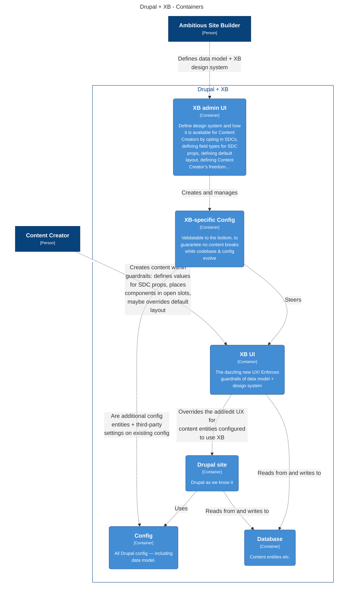

```mermaid
graph LR
  linkStyle default fill:#ffffff

  subgraph diagram ["Drupal + XB - Containers"]
    style diagram fill:#ffffff,stroke:#ffffff

    1["<div style='font-weight: bold'>Ambitious Site Builder</div><div style='font-size: 70%; margin-top: 0px'>[Person]</div>"]
    style 1 fill:#08427b,stroke:#052e56,color:#ffffff
    2["<div style='font-weight: bold'>Content Creator</div><div style='font-size: 70%; margin-top: 0px'>[Person]</div>"]
    style 2 fill:#08427b,stroke:#052e56,color:#ffffff

    subgraph 3 [Drupal + XB]
      style 3 fill:#ffffff,stroke:#0b4884,color:#0b4884

      10("<div style='font-weight: bold'>XB UI</div><div style='font-size: 70%; margin-top: 0px'>[Container]</div><div style='font-size: 80%; margin-top:10px'>The dazzling new UX! Enforces<br />guardrails of data model +<br />design system</div>")
      style 10 fill:#438dd5,stroke:#2e6295,color:#ffffff
      13("<div style='font-weight: bold'>Config</div><div style='font-size: 70%; margin-top: 0px'>[Container]</div><div style='font-size: 80%; margin-top:10px'>All Drupal config — including<br />data model.</div>")
      style 13 fill:#438dd5,stroke:#2e6295,color:#ffffff
      15("<div style='font-weight: bold'>Drupal site</div><div style='font-size: 70%; margin-top: 0px'>[Container]</div><div style='font-size: 80%; margin-top:10px'>Drupal as we know it</div>")
      style 15 fill:#438dd5,stroke:#2e6295,color:#ffffff
      18("<div style='font-weight: bold'>Database</div><div style='font-size: 70%; margin-top: 0px'>[Container]</div><div style='font-size: 80%; margin-top:10px'>Content entities etc.</div>")
      style 18 fill:#438dd5,stroke:#2e6295,color:#ffffff
      6("<div style='font-weight: bold'>XB admin UI</div><div style='font-size: 70%; margin-top: 0px'>[Container]</div><div style='font-size: 80%; margin-top:10px'>Define design system and how<br />it is available for Content<br />Creators by opting in SDCs,<br />defining field types for SDC<br />props, defining default<br />layout, defining Content<br />Creator’s freedom…</div>")
      style 6 fill:#438dd5,stroke:#2e6295,color:#ffffff
      8("<div style='font-weight: bold'>XB-specific Config</div><div style='font-size: 70%; margin-top: 0px'>[Container]</div><div style='font-size: 80%; margin-top:10px'>Validatable to the bottom, to<br />guarantee no content breaks<br />while codebase & config<br />evolve</div>")
      style 8 fill:#438dd5,stroke:#2e6295,color:#ffffff
    end

    2-. "<div>Creates content within<br />guardrails: defines values<br />for SDC props, places<br />components in open slots,<br />maybe overrides default<br />layout</div><div style='font-size: 70%'></div>" .->10
    8-. "<div>Steers</div><div style='font-size: 70%'></div>" .->10
    8-. "<div>Are additional config<br />entities + third-party<br />settings on existing config</div><div style='font-size: 70%'></div>" .->13
    10-. "<div>Overrides the add/edit UX for<br />content entities configured<br />to use XB</div><div style='font-size: 70%'></div>" .->15
    15-. "<div>Uses</div><div style='font-size: 70%'></div>" .->13
    15-. "<div>Reads from and writes to</div><div style='font-size: 70%'></div>" .->18
    10-. "<div>Reads from and writes to</div><div style='font-size: 70%'></div>" .->18
    1-. "<div>Defines data model + XB<br />design system</div><div style='font-size: 70%'></div>" .->6
    6-. "<div>Creates and manages</div><div style='font-size: 70%'></div>" .->8
  end
```
