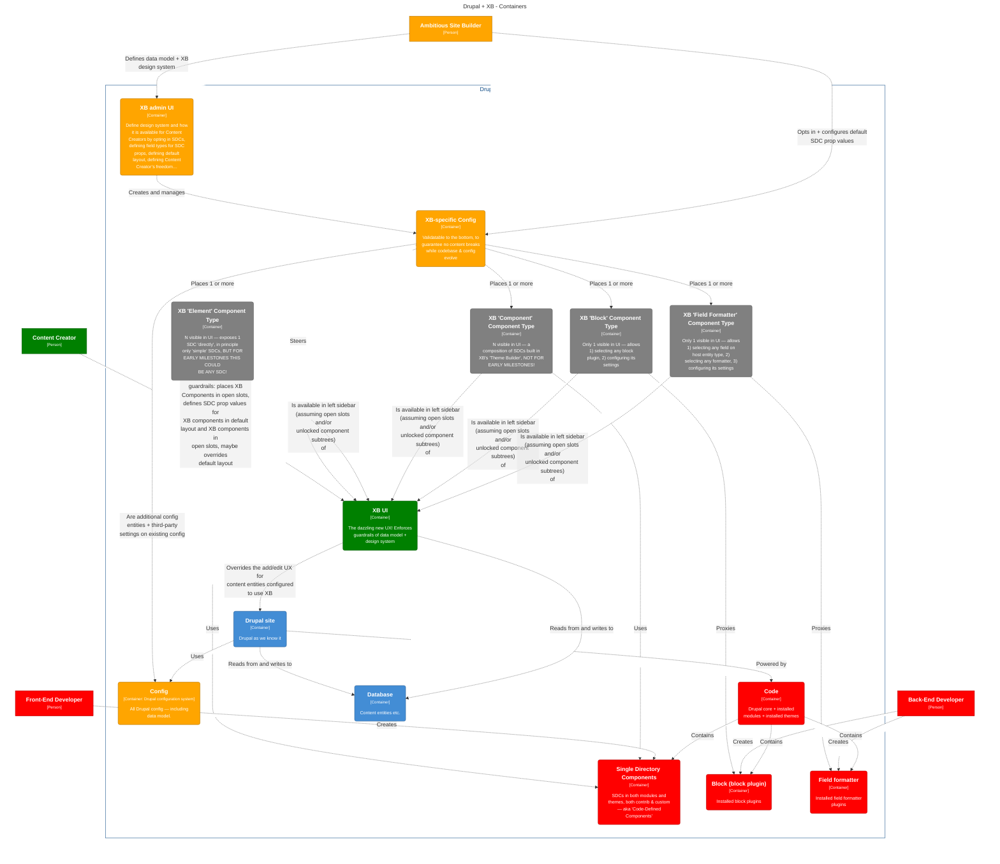

```mermaid
graph LR
  linkStyle default fill:#ffffff

  subgraph diagram ["Drupal + XB - Containers"]
    style diagram fill:#ffffff,stroke:#ffffff

    1["<div style='font-weight: bold'>Ambitious Site Builder</div><div style='font-size: 70%; margin-top: 0px'>[Person]</div>"]
    style 1 fill:#ffa500,stroke:#b27300,color:#ffffff
    2["<div style='font-weight: bold'>Content Creator</div><div style='font-size: 70%; margin-top: 0px'>[Person]</div>"]
    style 2 fill:#008000,stroke:#005900,color:#ffffff
    3["<div style='font-weight: bold'>Front-End Developer</div><div style='font-size: 70%; margin-top: 0px'>[Person]</div>"]
    style 3 fill:#ff0000,stroke:#b20000,color:#ffffff
    4["<div style='font-weight: bold'>Back-End Developer</div><div style='font-size: 70%; margin-top: 0px'>[Person]</div>"]
    style 4 fill:#ff0000,stroke:#b20000,color:#ffffff

    subgraph 5 [Drupal + XB]
      style 5 fill:#ffffff,stroke:#0b4884,color:#0b4884

      10("<div style='font-weight: bold'>XB admin UI</div><div style='font-size: 70%; margin-top: 0px'>[Container]</div><div style='font-size: 80%; margin-top:10px'>Define design system and how<br />it is available for Content<br />Creators by opting in SDCs,<br />defining field types for SDC<br />props, defining default<br />layout, defining Content<br />Creator’s freedom…</div>")
      style 10 fill:#ffa500,stroke:#b27300,color:#ffffff
      12("<div style='font-weight: bold'>XB-specific Config</div><div style='font-size: 70%; margin-top: 0px'>[Container]</div><div style='font-size: 80%; margin-top:10px'>Validatable to the bottom, to<br />guarantee no content breaks<br />while codebase & config<br />evolve</div>")
      click 12 https://www.drupal.org/project/experience_builder/issues/3444424 "https://www.drupal.org/project/experience_builder/issues/3444424"
      style 12 fill:#ffa500,stroke:#b27300,color:#ffffff
      20("<div style='font-weight: bold'>XB 'Element' Component Type</div><div style='font-size: 70%; margin-top: 0px'>[Container]</div><div style='font-size: 80%; margin-top:10px'>N visible in UI — exposes 1<br />SDC 'directly', in principle<br />only 'simple' SDCs, BUT FOR<br />EARLY MILESTONES THIS COULD<br />BE ANY SDC!</div>")
      click 20 https://www.drupal.org/project/experience_builder/issues/3444417 "https://www.drupal.org/project/experience_builder/issues/3444417"
      style 20 fill:#808080,stroke:#595959,color:#ffffff
      24("<div style='font-weight: bold'>XB 'Component' Component Type</div><div style='font-size: 70%; margin-top: 0px'>[Container]</div><div style='font-size: 80%; margin-top:10px'>N visible in UI — a<br />composition of SDCs built in<br />XB's 'Theme Builder', NOT FOR<br />EARLY MILESTONES!</div>")
      click 24 https://www.drupal.org/project/experience_builder/issues/3444417 "https://www.drupal.org/project/experience_builder/issues/3444417"
      style 24 fill:#808080,stroke:#595959,color:#ffffff
      28("<div style='font-weight: bold'>XB 'Block' Component Type</div><div style='font-size: 70%; margin-top: 0px'>[Container]</div><div style='font-size: 80%; margin-top:10px'>Only 1 visible in UI — allows<br />1) selecting any block<br />plugin, 2) configuring its<br />settings</div>")
      click 28 https://www.drupal.org/project/experience_builder/issues/3444417 "https://www.drupal.org/project/experience_builder/issues/3444417"
      style 28 fill:#808080,stroke:#595959,color:#ffffff
      31("<div style='font-weight: bold'>XB 'Field Formatter' Component Type</div><div style='font-size: 70%; margin-top: 0px'>[Container]</div><div style='font-size: 80%; margin-top:10px'>Only 1 visible in UI — allows<br />1) selecting any field on<br />host entity type, 2)<br />selecting any formatter, 3)<br />configuring its settings</div>")
      click 31 https://www.drupal.org/project/experience_builder/issues/3444417 "https://www.drupal.org/project/experience_builder/issues/3444417"
      style 31 fill:#808080,stroke:#595959,color:#ffffff
      34("<div style='font-weight: bold'>Single Directory Components</div><div style='font-size: 70%; margin-top: 0px'>[Container]</div><div style='font-size: 80%; margin-top:10px'>SDCs in both modules and<br />themes, both contrib & custom<br />— aka 'Code-Defined<br />Components'</div>")
      style 34 fill:#ff0000,stroke:#b20000,color:#ffffff
      38("<div style='font-weight: bold'>Block (block plugin)</div><div style='font-size: 70%; margin-top: 0px'>[Container]</div><div style='font-size: 80%; margin-top:10px'>Installed block plugins</div>")
      style 38 fill:#ff0000,stroke:#b20000,color:#ffffff
      41("<div style='font-weight: bold'>Field formatter</div><div style='font-size: 70%; margin-top: 0px'>[Container]</div><div style='font-size: 80%; margin-top:10px'>Installed field formatter<br />plugins</div>")
      style 41 fill:#ff0000,stroke:#b20000,color:#ffffff
      44("<div style='font-weight: bold'>XB UI</div><div style='font-size: 70%; margin-top: 0px'>[Container]</div><div style='font-size: 80%; margin-top:10px'>The dazzling new UX! Enforces<br />guardrails of data model +<br />design system</div>")
      click 44 https://www.drupal.org/project/experience_builder/issues/3454094 "https://www.drupal.org/project/experience_builder/issues/3454094"
      style 44 fill:#008000,stroke:#005900,color:#ffffff
      52("<div style='font-weight: bold'>Config</div><div style='font-size: 70%; margin-top: 0px'>[Container: Drupal configuration system]</div><div style='font-size: 80%; margin-top:10px'>All Drupal config — including<br />data model.</div>")
      style 52 fill:#ffa500,stroke:#b27300,color:#ffffff
      54("<div style='font-weight: bold'>Code</div><div style='font-size: 70%; margin-top: 0px'>[Container]</div><div style='font-size: 80%; margin-top:10px'>Drupal core + installed<br />modules + installed themes</div>")
      style 54 fill:#ff0000,stroke:#b20000,color:#ffffff
      58("<div style='font-weight: bold'>Drupal site</div><div style='font-size: 70%; margin-top: 0px'>[Container]</div><div style='font-size: 80%; margin-top:10px'>Drupal as we know it</div>")
      style 58 fill:#438dd5,stroke:#2e6295,color:#ffffff
      62("<div style='font-weight: bold'>Database</div><div style='font-size: 70%; margin-top: 0px'>[Container]</div><div style='font-size: 80%; margin-top:10px'>Content entities etc.</div>")
      style 62 fill:#438dd5,stroke:#2e6295,color:#ffffff
    end

    1-. "<div>Defines data model + XB<br />design system</div><div style='font-size: 70%'></div>" .->10
    10-. "<div>Creates and manages</div><div style='font-size: 70%'></div>" .->12
    1-. "<div>Opts in + configures default<br />SDC prop values</div><div style='font-size: 70%'></div>" .->12
    12-. "<div>Places 1 or more</div><div style='font-size: 70%'></div>" .->20
    12-. "<div>Places 1 or more</div><div style='font-size: 70%'></div>" .->24
    12-. "<div>Places 1 or more</div><div style='font-size: 70%'></div>" .->28
    12-. "<div>Places 1 or more</div><div style='font-size: 70%'></div>" .->31
    20-. "<div>Uses</div><div style='font-size: 70%'></div>" .->34
    24-. "<div>Uses</div><div style='font-size: 70%'></div>" .->34
    3-. "<div>Creates</div><div style='font-size: 70%'></div>" .->34
    28-. "<div>Proxies</div><div style='font-size: 70%'></div>" .->38
    4-. "<div>Creates</div><div style='font-size: 70%'></div>" .->38
    31-. "<div>Proxies</div><div style='font-size: 70%'></div>" .->41
    4-. "<div>Creates</div><div style='font-size: 70%'></div>" .->41
    2-. "<div>Creates content within<br />guardrails: places XB<br />Components in open slots,<br />defines SDC prop values for<br />XB components in default<br />layout and XB components in<br />open slots, maybe overrides<br />default layout</div><div style='font-size: 70%'></div>" .->44
    12-. "<div>Steers</div><div style='font-size: 70%'></div>" .->44
    20-. "<div>Is available in left sidebar<br />(assuming open slots and/or<br />unlocked component subtrees)<br />of</div><div style='font-size: 70%'></div>" .->44
    24-. "<div>Is available in left sidebar<br />(assuming open slots and/or<br />unlocked component subtrees)<br />of</div><div style='font-size: 70%'></div>" .->44
    28-. "<div>Is available in left sidebar<br />(assuming open slots and/or<br />unlocked component subtrees)<br />of</div><div style='font-size: 70%'></div>" .->44
    31-. "<div>Is available in left sidebar<br />(assuming open slots and/or<br />unlocked component subtrees)<br />of</div><div style='font-size: 70%'></div>" .->44
    12-. "<div>Are additional config<br />entities + third-party<br />settings on existing config</div><div style='font-size: 70%'></div>" .->52
    54-. "<div>Contains</div><div style='font-size: 70%'></div>" .->34
    54-. "<div>Contains</div><div style='font-size: 70%'></div>" .->38
    54-. "<div>Contains</div><div style='font-size: 70%'></div>" .->41
    44-. "<div>Overrides the add/edit UX for<br />content entities configured<br />to use XB</div><div style='font-size: 70%'></div>" .->58
    58-. "<div>Uses</div><div style='font-size: 70%'></div>" .->52
    58-. "<div>Powered by</div><div style='font-size: 70%'></div>" .->54
    58-. "<div>Reads from and writes to</div><div style='font-size: 70%'></div>" .->62
    44-. "<div>Reads from and writes to</div><div style='font-size: 70%'></div>" .->62
  end
```
