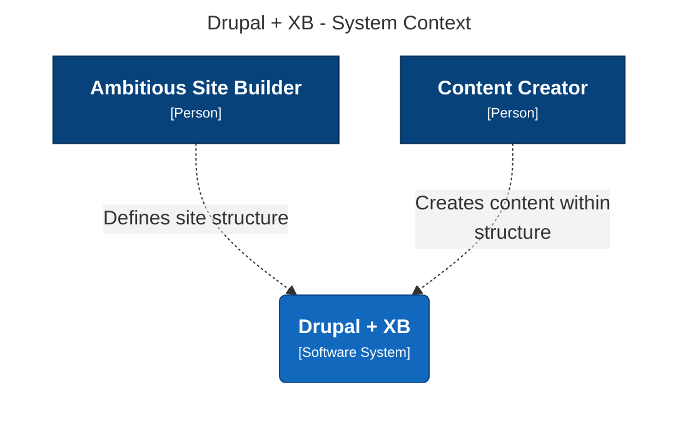

```mermaid
graph LR
  linkStyle default fill:#ffffff

  subgraph diagram ["Drupal + XB - System Context"]
    style diagram fill:#ffffff,stroke:#ffffff

    1["<div style='font-weight: bold'>Ambitious Site Builder</div><div style='font-size: 70%; margin-top: 0px'>[Person]</div>"]
    style 1 fill:#08427b,stroke:#052e56,color:#ffffff
    2["<div style='font-weight: bold'>Content Creator</div><div style='font-size: 70%; margin-top: 0px'>[Person]</div>"]
    style 2 fill:#08427b,stroke:#052e56,color:#ffffff
    3("<div style='font-weight: bold'>Drupal + XB</div><div style='font-size: 70%; margin-top: 0px'>[Software System]</div>")
    style 3 fill:#1168bd,stroke:#0b4884,color:#ffffff

    1-. "<div>Defines site structure</div><div style='font-size: 70%'></div>" .->3
    2-. "<div>Creates content within<br />structure</div><div style='font-size: 70%'></div>" .->3
  end
```
