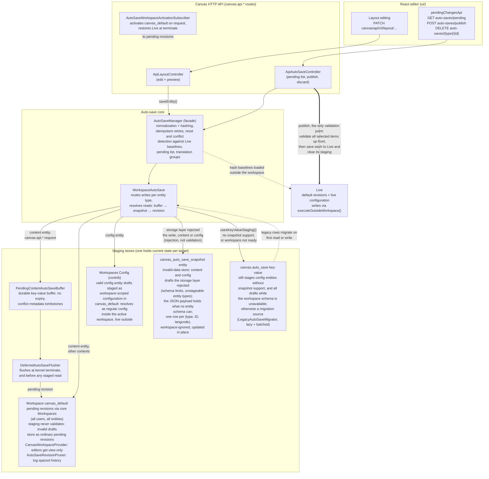

# Workspace-staged auto-save architecture

High-level view of how Canvas stages auto-saves in Drupal core Workspaces
(see [ADR 0014](../adr/0014-stage-autosaves-in-a-dedicated-workspace.md),
including its Workspaces Config amendment).
Workspaces is a storage layer only: content drafts become pending revisions
and config drafts become workspace-scoped configuration (via the contrib
Workspaces Config module) in the shared `canvas_default` workspace, while
publishing stays in the Canvas pipeline with per-item validation and
granularity. Core's `Workspace::publish()` is never called.

Invariant: for any target entity (per type, ID, and langcode), exactly one
staging store holds the current draft. Reads resolve in the order pending
buffer, then snapshot row, then the primary store: workspace revision for
content, workspace-scoped configuration for config. A successful persist to
a primary store deletes the shadowing snapshot row.

Invalid is not the same as unstorable. Staging never runs entity validation,
so a draft that would fail validation stores in its primary store like any
other draft; the snapshot fallback exists only for drafts the storage layer
refuses to write. Validation runs once, at publish, per selected item, and
an invalid item is reported as a violation without blocking the other items.

Publish clears the published item's staging (buffer row, snapshot row,
tracked pending revisions, workspace-scoped configuration, pruner state),
which also releases core's exclusive-edit lock on the entity. Discard does
the same per translation group, and dependent staged entities such as URL
aliases follow their host through both.
